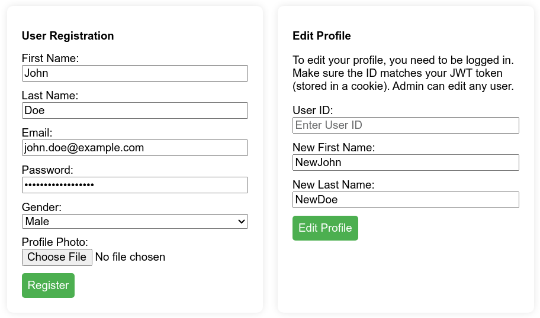
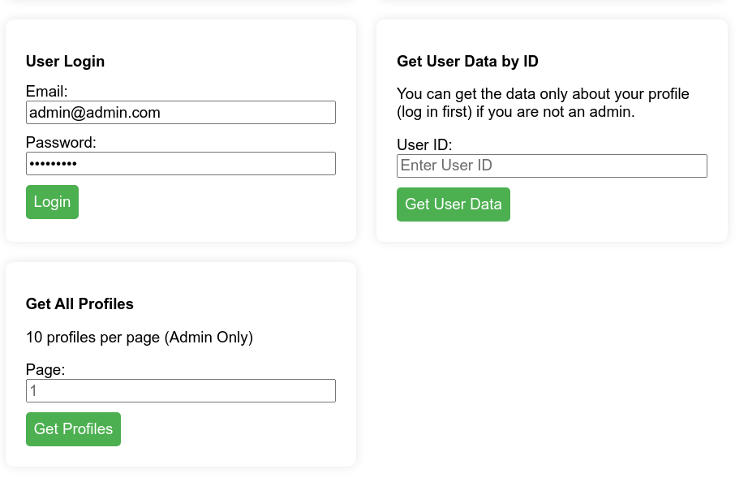

# node-express-mysql-api

В данном проекте реализован API обеспечивающий безопасную систему регистрации, входа, редактирования профиля и получения данных. Для использования API создан веб-интерфейс (html + css + javascript). Также можно использовывать Postman или Insomnia.

## Ключевые функции:

1. Регистрация пользователей:
   Пользователи могут зарегистрироваться, указав имя, электронную почту, пароль, пол и фотографию профиля.
   Поддерживается загрузка файлов для фотографий профиля с помощью библиотеки Multer (расширения ).

2. Редактирование профиля:
   Аутентифицированные пользователи могут редактировать свои профили, указав свой идентификатор пользователя, новое имя / фамилию.
   Администратор имеет более широкий доступ, позволяющий редактировать профиль любого пользователя.

3. Вход пользователей в систему:
   Безопасная аутентификация пользователей осуществляется с помощью JSON Web Tokens (JWT).
   Пользователи могут войти в систему, указав свою электронную почту и пароль, и получить JWT для последующих запросов, который будет храниться в cookie.

4. Получение данных пользователя по идентификатору:
   Пользователи могут получить данные своего профиля, указав свой ID.
   Администратор имеет более широкий доступ, позволяющий им получать данные любого пользователя.

5. Получить все профили с пагинацией:
   Эксклюзивная для администраторов функция получения всех профилей пользователей с пагинацией (10 профилей на страницу).
   Профили сортируются по дате регистрации.

## Используемые технологии:

Бэкенд: Node.js и Express.
База данных: MySQL, Sequelize (ORM).
Middleware: Multer для загрузки файлов.
Аутентификация: JSON Web Tokens (JWT), cookie-parser.

## Использование

1. Необходимо клонировать репозиторий удобным способом.
2. Установите зависимости проекта (npm install).
3. Установите базу данных MySQL (находится в корне репозитория).
4. Измените переменные окружения в файле .env в зависимости от конфигурации вашей базы данных.
5. Запустите сервер Node.js (npm start)

## ВАЖНО.

- Файл .env находится в репозитории. Перед деплоем необходимо занести его в файл .gitignore.
- Для получения доступа к профайлу админа, введите email: admin@admin.com, пароль "Admin123,"
